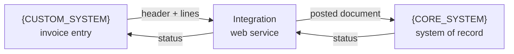
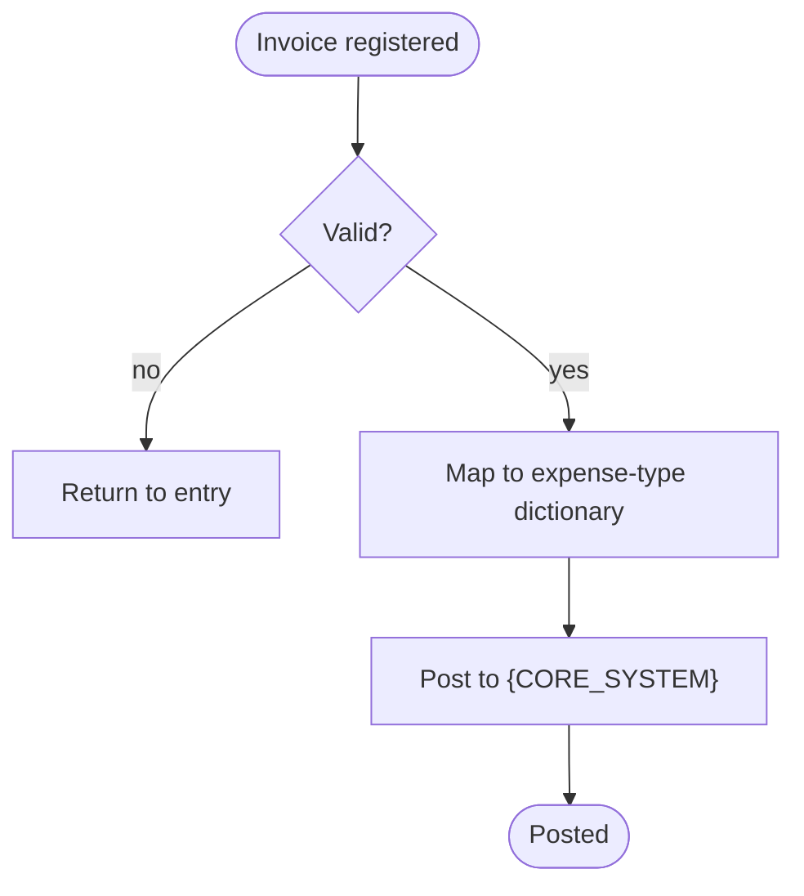

# Data flow - Invoice flow (FV)

> Example. All content fictional.

## 1. Overview

{CUSTOM_SYSTEM} is the source of invoices; {CORE_SYSTEM} is the system of
record. Headers and lines flow one way, with a status returned.

## 2. Data flow diagram (DFD)

## 3. Business process (BPMN-style)

## 4. Changelog

| Date | Version | Change | Source |
|------|---------|--------|--------|
| 2026-05-07 | v0.1 | Initial draft | note 2026-05-07 |

## 5. Open items

| # | Question | Context |
|---|----------|---------|
| 1 | Expense-type dictionary name | from note 2026-05-07 |
